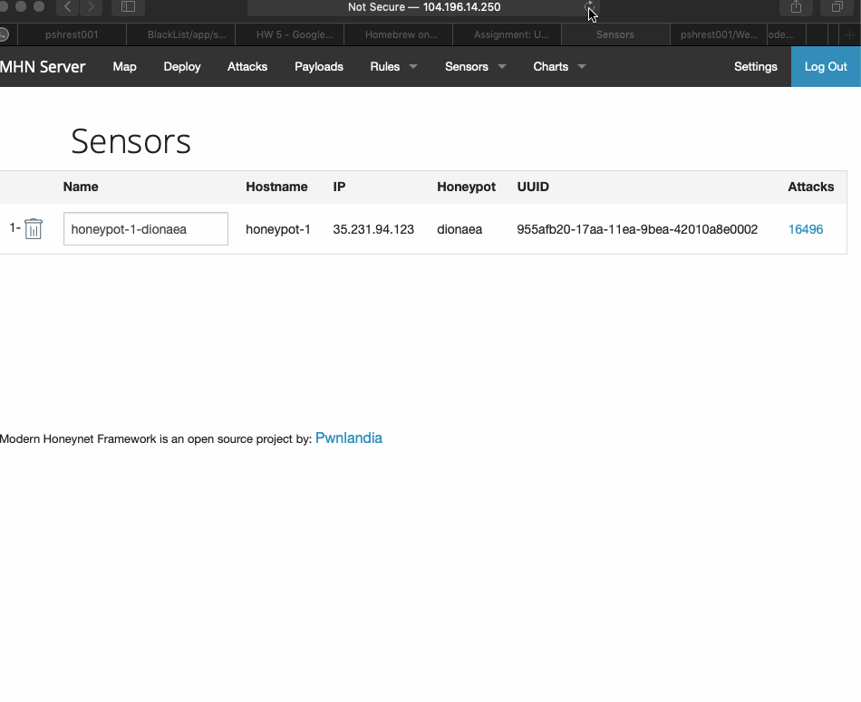

# Week 10 and Week 11 Honeypot

Time spent: **5** hours spent in total

> Objective: Stand up a basic honeypot and demonstrate its effectiveness at detecting and/or collecting data about an attack.
Honeypots Deployed

## Honeypot Deployed 
  Ubuntu Dionaea
  
## Issues Encountered
  Setting up the virtual environments were time consuming and tricky. I did not have kali linux in my MAC but in my windows therefore, i had to use mh-admin and download nmap from there. 

## Summary of Data Collected 
  Using Google Cloud Platform and HoneyPot to setup, I've collected the following data from attackersfrom honeypot. 

## Number of Attacks from Dianoea 
  16,496
  
## Malware Samples
  - 
  - 
  

## Notes
  I included json file with a list of all the attackers. 
